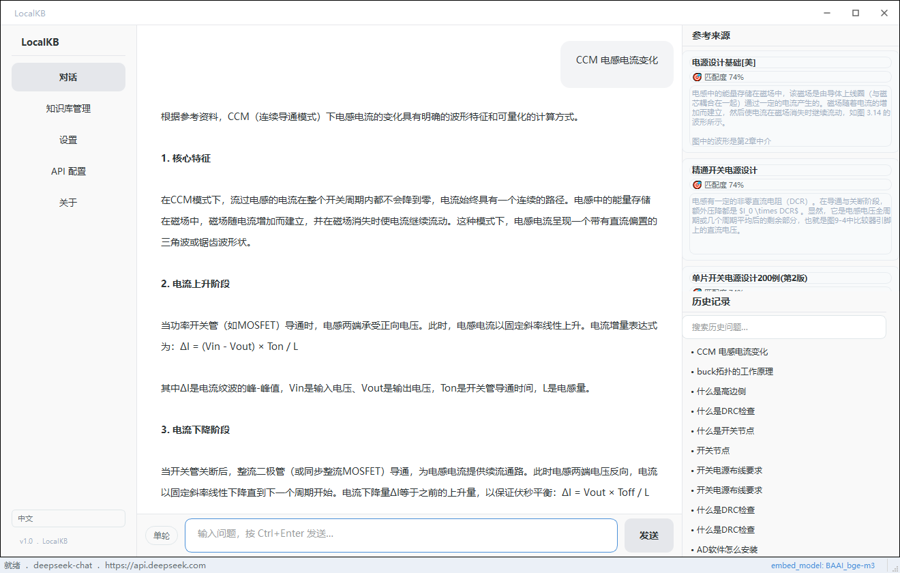

# 🔮 LocalKB — 本地 RAG 知识库

<p align="center">
  
  
  
  
</p>

<p align="center">
  <b>拖入文档，自然语言提问。📄 + 💬 = ✨ &nbsp; ₍ᐢ•ﻌ•ᐢ₎ &nbsp; /ᐠ. .ᐟ\ฅ &nbsp; ʕ·ᴥ·ʔ &nbsp; ₍ᐢ.ˬ.ᐢ₎</b>
</p>

<p align="center">
  文档存储 & 向量检索 <b>完全在本机</b> · LLM 推理调用远程 API（DeepSeek / OpenAI / Ollama）
</p>

<p align="center">
  
</p>

---

## ✨ 功能特色

| 模块 | 说明 |
|------|------|
| 📥 **文档索引** | `.md` `.txt` `.pdf` `.docx` `.pptx` `.ppt`，自动分块、去重、嵌入 |
| ✂️ **切片策略** | 结构化（按 H2 标题） / 语义相似度 / 迟交互分块 |
| 🔀 **混合检索** | Qdrant 内置 RRF 融合稠密向量 + 稀疏词法权重 |
| 🎯 **HyDE 扩展** | 先生成假设性答案再检索，提升命中率 |
| 🏆 **重排序** | Cross-encoder（BGE-Reranker）对召回结果精排 |
| 💬 **对话模式** | 单轮 / 多轮自由切换 |
| ⚡ **流式输出** | 答案逐字实时显示 |
| 📎 **参考来源** | 文档名、章节标题、匹配度分数一目了然 |
| 📜 **历史记录** | 本地存储，可搜索回看 |
| 🧙 **首次引导** | 启动即配置向导，零门槛上手 |
| 🏎️ **秒开启动** | 窗口 0.3s 弹出，后台并行初始化，不卡顿 |

---

## 🚀 快速开始

```bash
git clone https://github.com/zhuzhu-unnn/LocalKB.git
cd LocalKB

# 双击启动（首次自动创建 venv 并安装依赖）
启动.bat
```

---

## 📖 使用流程

| 步骤 | 操作 |
|:---:|---|
| 1 | **引导设置** → 选择语言、配置 API Key、选嵌入模型 |
| 2 | **上传文档** → 拖入或点击选择，自动切片入库 |
| 3 | **调整参数** → 检索条数、温度、切片策略、对话模式 |
| 4 | **开始提问** → 自然语言问答，流式输出 + 来源标注 |

### 💡 文档预处理建议

对于 **PDF 扫描件、复杂排版、含表格/公式的文档**，建议先用 [MinerU](https://github.com/opendatalab/MinerU) 预处理，效果远优于内置解析器：

```bash
# 1. MinerU 将 PDF 转为高质量 Markdown（自动识别表格、公式、阅读顺序）
mineru -p /path/to/pdf -o /path/to/output

# 2. 输出的 .md 按章节/主题手动分块，放入 data/docs/

# 3. 打开 LocalKB → 知识库管理 → 扫描新文件
```

纯文本 Markdown / txt 直接拖入即可，内置结构化分块器足够胜任。

---

## 🧠 嵌入模型

| 模型 | 维度 | 语言 | 大小 | 稀疏向量 |
|------|:---:|------|------|----------|
| 🐣 BGE-small-zh-v1.5 | 512 | 中文 | ~95 MB | 字 n-gram |
| 🌍 all-MiniLM-L6-v2 | 384 | 英文 | ~90 MB | 字 n-gram |
| 🦾 BGE-M3 | 1024 | 多语言 | ~2 GB | 字 n-gram（备选 FlagEmbedding 原生） |

- 🐣 **BGE-small-zh-v1.5** 内置随仓库分发，开箱即用
- 🌍 / 🦾 在设置页切换后自动从 ModelScope 下载（国内快）
- 稠密向量 → **SentenceTransformer** 加载
- 稀疏向量 → **纯 Python 字符 n-gram 哈希**（无 C 扩展、零依赖、稳如老狗）
- 若环境已安装 FlagEmbedding，自动切换 BGE-M3 原生词法权重

---

## 🔧 技术栈

| 组件 | 技术 | 备注 |
|------|------|------|
| 🖼️ 界面 | PySide6 (Qt for Python) | 自绘 frameless 窗口 |
| 🗄️ 向量库 | Qdrant Embedded | Rust + RocksDB，嵌入式运行 |
| 🧬 稠密嵌入 | SentenceTransformer | BGE / MiniLM 系列 |
| 🔤 稀疏嵌入 | 字符 n-gram 哈希 | 纯 Python，无外部依赖 |
| 🔀 检索融合 | Qdrant 内置 RRF | 稠密 + 稀疏联合排序 |
| 🏆 重排序 | BGE-Reranker-v2-m3 | Cross-encoder，可选 |
| 🤖 LLM | OpenAI 兼容 API | DeepSeek / OpenAI / Ollama |
| 📄 文档解析 | PyMuPDF / python-docx / python-pptx | — |
| 🎨 Markdown | 自研 Qt rich-text 渲染器 | `<div>` 方案绕过 Qt 标题边距 |
| 🌐 i18n | 自研管理器 | 中 / 英双语 |
| 🧵 后台任务 | QThread Worker 模式 | 索引、问答、初始化、模型预热 |
| 📦 打包 | 未打包，源码运行 | `启动.bat` 一键启动 |

---

## 📁 项目结构

```
LocalKB/
├── core/                    # 核心逻辑，无 GUI 依赖
│   ├── indexing/            # 解析、分块、嵌入、去重
│   │   ├── chunkers/        # 结构化 / 语义 / 迟交互分块
│   │   ├── embedder.py      # 稠密 + 稀疏嵌入
│   │   └── sparse_embedder.py  # 纯 Python n-gram 稀疏向量
│   ├── retrieval/           # 向量库、混合检索、重排序
│   │   ├── vector_store.py  # Qdrant Embedded 封装
│   │   └── hybrid.py        # 稠密 + 稀疏 RRF 融合
│   └── qa/                  # LLM 客户端、提示词、HyDE、会话
├── config/                  # 配置管理、模型预设
├── desktop_app/             # PySide6 GUI
│   ├── pages/               # 对话、知识库、设置、API配置、向导
│   ├── widgets/             # 聊天气泡、输入框、来源面板、历史列表
│   ├── workers/             # QThread 后台任务
│   │   ├── startup_worker.py  # 向量库 + QA 引擎初始化
│   │   ├── warmup_worker.py   # 嵌入模型预热
│   │   ├── qa_worker.py       # 流式问答
│   │   └── index_worker.py    # 文档索引
│   └── utils/               # i18n、Markdown 渲染、模型下载
├── data/                    # 运行时数据（不入 git）
├── models/                  # 嵌入模型文件
├── tools/                   # 辅助脚本
├── docs/                    # 文档 & 截图
├── 启动.bat                 # 一键启动
└── setup.bat                # 环境安装
```

---

<p align="center">
  Made with 💙 for local-first knowledge management<br>
  MIT © LocalKB Contributors
</p>
